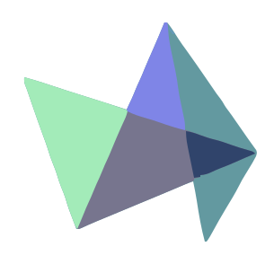
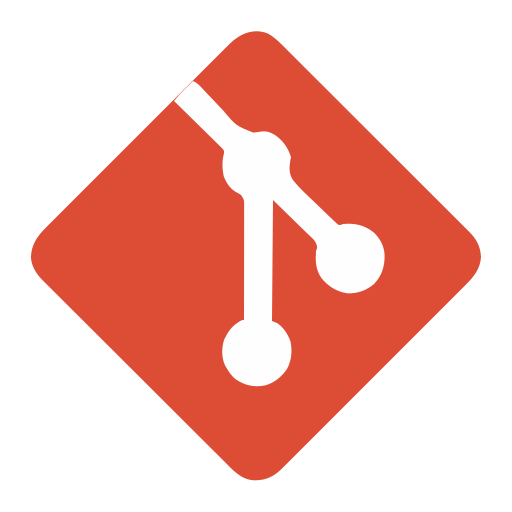
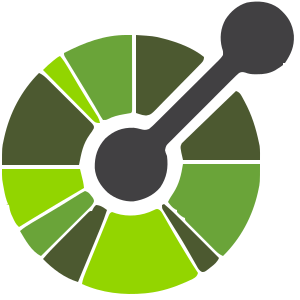
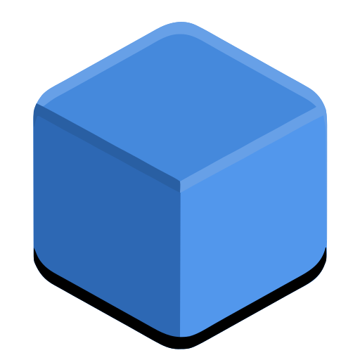

<!--APLICACIONES WEB-->

<!------Portfolio Java------>  

##  Aplicaciones Web

  
  
 

 
 ### { Portfolio Desarrollo de Software implementando Angular, Angular Material, Bootstrap, Api Highcharts, Scss, GSAP, Animation, DialogFlow y Otras Tecnologías. }
 
    

  ###  [[Repositorio]](https://github.com/andresWeitzel/Portfolio_Software_Developer) [|]() [[PlayList]](https://www.youtube.com/playlist?list=PLCl11UFjHurCQxO9rYKlL2E3bZWTLC_Kr)
      
 
 
  
   
 

   
 ###  Stack implementado
  
 

   
  
  
  
  
  
  
   
  
 

 

 <!------Fin Portfolio Java------>  

 
 
 
 
 
 
 
<!------Microfront GPT-J-6B------>  

 
 ### { MicroFrontEnd y Módulo npm para la implementación de Modelos de IA de Procesamiento de Lenguaje Natural (GPT-J-6B , GPT-3 , Otros).  }
  
   

 ###  [[Repositorio]](https://github.com/andresWeitzel/Microfront_IA-NLP_React) [|]() [[PlayList]](https://www.youtube.com/playlist?list=PLCl11UFjHurBBWHg1pGL47Ok2Iy-AZPYB)

 
 
  
   
 

   
 ###  Stack implementado
   
 

   
  
  
  
  
   
  
 

 

 <!------Fin Microfront GPT-J-6B------>  

 
 
 
 
 
 

<!------Gestion micrelectronica spring------> 

 
 ### { Aplicación Web para la Gestión de Productos de Microelectrónica implementando Spring Boot, Maven, Lombok, Thymeleaf, Bootstrap, Js, Api Highcharts, Open-Api-v3.0, Oracle y Otras Tecnologías. }
 
   

   ###  [[Repositorio]](https://github.com/andresWeitzel/AppGestionMicroelectronica_SpringBoot) [|]() [[PlayList]](https://www.youtube.com/playlist?list=PLCl11UFjHurAhsy9K0G0TIBmiSSqP_lN3)
  
 
 
  
   
 

 ###  Stack implementado
 

   
    
  
  
     
  
  
   
   
  
  
  
  
  
   
  
 

 

 
 <!------Fin Gestion micrelectronica spring------> 

 
 
 
 
 
 

 <!----- Microfrontend micrelectronica React------> 
 

 ### { Aplicación Web MicroFrontEnd Microelectrónica implementando React, Html5, Scss, Highcharts, Bootstrap, Spring Boot, Spring MVC, Spring Data JPA, SpringFox, Swagger UI, Maven, Lombok, Postman, Log4j, Git, SQLDeveloper, Oracle XE 21c y Otras Tecnologías. }

    

  ###  [[Repositorio]](https://github.com/andresWeitzel/App_MicroFrontEnd_MicroElectr_React) [|]() [[PlayList]](https://www.youtube.com/playlist?list=PLCl11UFjHurDLgSaycW__gUQwS3vOBZLD)
   
 
 
   

  
   
 

 ###  Stack implementado
 

   
  
  
  
  
  
  
  
  
   
   
  
  
  
  
  
   
  
 

 

 <!----- Fin Microfrontend micrelectronica React------> 

  
 
 
 
 
 
 
  

<!----- Microfrontend Productos de Supermercado------> 

 ### { MicroFrontEnd acerca de Productos de Supermercado implementando Spring Boot, Spring Security, JWT, Angular, Maven, Lombok, Bootstrap, Api Highcharts, Open-Api-v3.0, PostgreSQL y Otras Tecnologías. }
 
    

  ###  [[Repositorio]](https://github.com/andresWeitzel/App_MicroFrontEnd_Productos_SpringBoot_SpringSecurity_PostgreSQL) [|]() [[PlayList]](https://www.youtube.com/playlist?list=PLCl11UFjHurBcKBhduZ4suiDSMbyyBqCO)
    
 
 
   

  
    
 

  
  
 ###  Stack implementado 
 

   
    
  
  
     
  
  
   
   
    
  
  
  
  
  
   
   
 

 

  
  <!----- FIN Microfrontend Productos de Supermercado------> 

 
 
 
 
 
 
  
  
<!----- Aplicación Web ElectroThings------> 
  

 ### { Aplicación Web ElectroThings acerca de Productos de Electrónicos Generales aplicando HTML5, CSS3, SCSS, Angular, Bootstrap, Highchart, Spring-Boot, Spring Security, Spring MVC, Microservicios, SpringFox, Swagger UI, Git, DBeaver, PgAdmin, PostgreSQL y Otras Tecnologías. }
  
  

  
  ###  [[Repositorio]](https://github.com/andresWeitzel/AppElectroThings_Angular_Bootstrap_SpringBoot_MongoDB) [|]() [[PlayList]](https://www.youtube.com/playlist?list=PLCl11UFjHurAg4I2Sv8Q7rpkNUTk5fQQy)
    
 
 
   

  
   
 

   
 ###  Stack implementado
 

   
    
  
  
   
  
  
   
   
  
  
  
  
  
   
  
 

 

  
  <!----- FIN Aplicación Web ElectroThings------> 

 
 
 
 
 
 

<!----- Aplicación Web Productos IOT------> 

 ### { Aplicación Web para la Gestión de Productos IOT desarrollado con Java 8 EE, Maven, JSP, Servlets, BootstrapV4.6 y Otras Tecnologías. }
 

 
   ###  [[Repositorio]](https://github.com/andresWeitzel/IotProductosJsp_app)
  
 
 
   

  
 

  
 ###  Stack implementado
 

    
    
  
  
  
  
  
  
  
  
  
 

 

 <!----- FIN Aplicación Web Productos IOT------> 
 

 
 
 
 
 
 

 <!----- FIN Aplicación Web Violenc. de género------> 

 ### { Aplicación Web sobre Violencia de Género, Discriminación, etc desarrollado con Angular12, Boostrapv4.6, HTML5, CSS3 y Otras Tecnologías }

     
###  [[Repositorio]](https://github.com/andresWeitzel/WebAppAngularBootstrap)
 
 
 
   

  
 

   
 ###  Stack implementado  
 

   
    
  
  
  
  
  
  
  
 

 

 <!----- FIN Aplicación Web Violenc. de género------> 

<!--FIN APLICACIONES WEB-->
