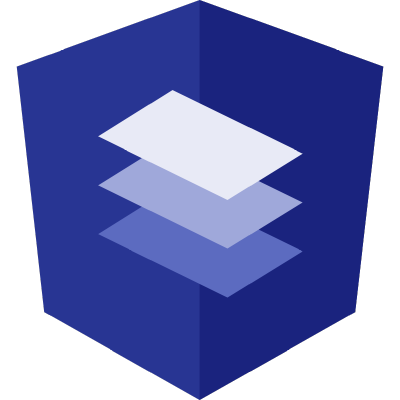
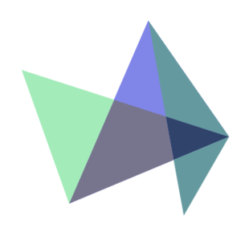
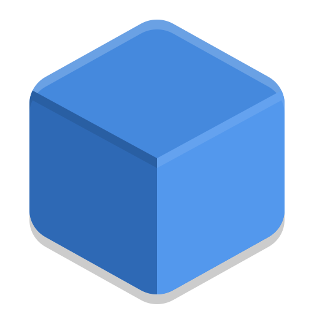
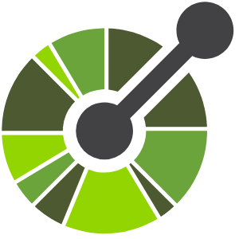

 

    
    

##  Web Applications

 

Central repository for web application projects focused on frontend development, fullstack integrations, and micro-frontend architectures.

 

 * Languages : Java, JavaScript, HTML5, CSS3, SCSS, others.
 * Frameworks : Angular, React, Spring Framework, Bootstrap, others.
 * Spring modules : Spring Boot, Spring MVC, Spring Data JPA, Spring Security, SpringFox, others.
 * ORM : JPA-Hibernate, others.
 * Databases : Oracle, PostgreSQL, MySQL, others.
 * Libraries : Lombok, Highcharts, GSAP, Angular Material, Log4j, others.
 * Tools : STS, VSC, Netbeans, Postman, Maven, Swagger UI, Git, PgAdmin, SQL Developer, others.

 

 

<!------Start Index----->

## Index 📜

 
 See 

  

#### 🗂️ Projects

* [Portfolio Software Developer](#portfolio-software-developer-)

  

    
    
    
    
    
    
    
    
    
  

* [MicroFrontEnd IA NLP React](#microfrontend-ia-nlp-react-)

  

    
    
    
    
    
    
    
  

* [Microelectronics Management SpringBoot](#microelectronics-management-springboot-)

  

    
    
    
    
    
    
    
    
    
    
    
  

* [MicroFrontEnd Microelectronics React](#microfrontend-microelectronics-react-)

  

    
    
    
    
    
    
    
    
    
    
    
    
  

* [Micro FrontEnd App for Supermarket Products](#micro-frontend-app-for-supermarket-products-)

  

    
    
    
    
    
    
    
    
    
    
    
  

* [ElectroThings Angular SpringBoot](#electrothings-angular-springboot-)

  

    
    
    
    
    
    
    
    
    
    
    
  

* [IoT Products JSP](#iot-products-jsp-)

  

    
    
    
    
    
    
    
    
    
  

* [Gender Violence Awareness Angular](#gender-violence-awareness-angular-)

  

    
    
    
    
    
    
    
  

 

<!------Stop Index----->

 

## 🗂️ Projects

 

<!------START Portfolio_Software_Developer------>

### Portfolio Software Developer [🔝](#index-)

  

    
    
    
    
    
    
    
    
    
  

 

### Details

  
  

<!------END Portfolio_Software_Developer------->

 
 
 
 
 
 

<!------START Microfront_IA-NLP_React------>

### MicroFrontEnd IA NLP React [🔝](#index-)

  

    
    
    
    
    
    
    
  

 

### Details

  
  

<!------END Microfront_IA-NLP_React------->

 
 
 
 
 
 

<!------START AppGestionMicroelectronica_SpringBoot------>

### Microelectronics Management SpringBoot [🔝](#index-)

  

    
    
    
    
    
    
    
    
    
    
    
    
    
    
    
    
  

 

### Details

  
  

<!------END AppGestionMicroelectronica_SpringBoot------->

 
 
 
 
 
 

<!------START App_MicroFrontEnd_MicroElectr_React------>

### MicroFrontEnd Microelectronics React [🔝](#index-)

  

    
    
    
    
    
    
    
    
    
    
    
    
    
    
    
    
    
    
  

 

### Details

  
  

<!------END App_MicroFrontEnd_MicroElectr_React------->

 
 
 
 
 
 

<!------START Micro FrontEnd App for Supermarket Products------>

### Micro FrontEnd App for Supermarket Products [🔝](#index-)

  

    
    
    
    
    
    
    
    
    
    
    
    
    
    
    
    
    
  

 

### Details

  
  

<!------END Micro FrontEnd App for Supermarket Products------->

 
 
 
 
 
 

<!------START AppElectroThings_Angular_Bootstrap_SpringBoot_MongoDB------>

### ElectroThings Angular SpringBoot [🔝](#index-)

  

    
    
    
    
    
    
    
    
    
    
    
    
    
    
    
    
  

 

### Details

  
  

<!------END AppElectroThings_Angular_Bootstrap_SpringBoot_MongoDB------->

 
 
 
 
 
 

<!------START IotProductosJsp_app------>

### IoT Products JSP [🔝](#index-)

  

    
    
    
    
    
    
    
    
    
    
  

 

### Details

  

<!------END IotProductosJsp_app------->

 
 
 
 
 
 

<!------START WebAppAngularBootstrap------>

### Gender Violence Awareness Angular [🔝](#index-)

  

    
    
    
    
    
    
    
  

 

### Details

  

<!------END WebAppAngularBootstrap------->

 
 
 
 
 
 
