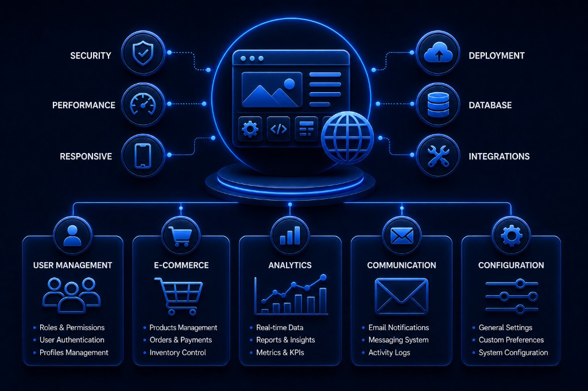
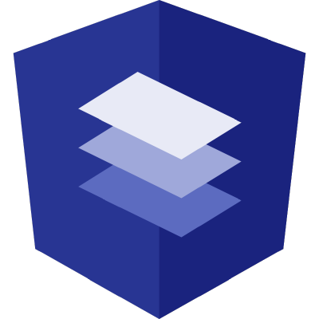
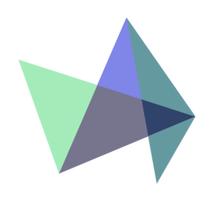
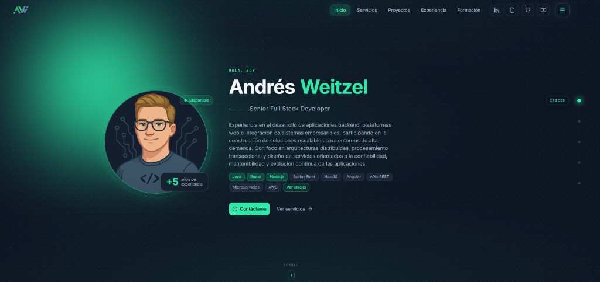



 

    
    

##  Web Applications

 

Central repository of web applications focused on designing modern, responsive interfaces, integrating frontend and backend layers in fullstack solutions, and exploring micro-frontend architectures to scale digital products.

The implementations range from professional portfolios and micro frontends with React or Angular to microelectronics management systems, supermarket product catalogs, electronic product platforms with Spring Boot, and IoT applications with JSP.

 

 * Languages: Java, JavaScript, HTML5, CSS3, SCSS, others.
 * Frameworks: Angular, React, Spring Framework, Bootstrap, others.
 * Spring modules: Spring Boot, Spring MVC, Spring Data JPA, Spring Security, SpringFox, others.
 * ORM: JPA-Hibernate, others.
 * Databases: Oracle, PostgreSQL, MySQL, others.
 * Libraries: Lombok, Highcharts, GSAP, Angular Material, Log4j, others.
 * Tools: STS, VSC, Netbeans, Postman, Maven, Swagger UI, Git, PgAdmin, SQL Developer, others.

 

 

<!------Start Index----->

## Index 📜

 
 See 

  

#### 🗂️ Projects

* [Portfolio Software Developer ](#portfolio-software-developer-)

  

    
    
    
    
    
    
    
  

* [Micro Frontend IA NLP React ](#micro-frontend-ia-nlp-react-)

  

    
    
    
    
    
    
    
  

* [Microelectronics Management Spring Boot ](#microelectronics-management-spring-boot-)

  

    
    
    
    
    
    
    
  

* [Micro Frontend Microelectronics React ](#micro-frontend-microelectronics-react-)

  

    
    
    
    
    
    
    
  

* [Micro Frontend Supermarket Products ](#micro-frontend-supermarket-products-)

  

    
    
    
    
    
    
    
  

* [ElectroThings Angular Spring Boot ](#electrothings-angular-spring-boot-)

  

    
    
    
    
    
    
    
  

* [IoT Products JSP ](#iot-products-jsp-)

  

    
    
    
    
    
    
    
  

 

<!------Stop Index----->

 

## 🗂️ Projects

 

<!------START Portfolio_Software_Developer------>

### Portfolio Software Developer 

  

    
    
    
    
    
    
    
  

 

### Details

<!-- -->

<!------END Portfolio_Software_Developer------->

 
 
 
 
 
 

<!------START Microfront_IA-NLP_React------>

### Micro Frontend IA NLP React 

  

    
    
    
    
    
    
    
  

 

### Details

<!-- -->

<!------END Microfront_IA-NLP_React------->

 
 
 
 
 
 

<!------START AppGestionMicroelectronica_SpringBoot------>

### Microelectronics Management Spring Boot 

  

    
    
    
    
    
    
    
  

 

### Details

<!-- -->

<!------END AppGestionMicroelectronica_SpringBoot------->

 
 
 
 
 
 

<!------START App_MicroFrontEnd_MicroElectr_React------>

### Micro Frontend Microelectronics React 

  

    
    
    
    
    
    
    
  

 

### Details

<!-- -->

<!------END App_MicroFrontEnd_MicroElectr_React------->

 
 
 
 
 
 

<!------START Micro_Frontend_Supermarket_Products------>

### Micro Frontend Supermarket Products 

  

    
    
    
    
    
    
    
  

 

### Details

<!-- -->

<!------END Micro_Frontend_Supermarket_Products------->

 
 
 
 
 
 

<!------START AppElectroThings_Angular_Bootstrap_SpringBoot_MongoDB------>

### ElectroThings Angular Spring Boot 

  

    
    
    
    
    
    
    
  

 

### Details

<!-- -->

<!------END AppElectroThings_Angular_Bootstrap_SpringBoot_MongoDB------->

 
 
 
 
 
 

<!------START IotProductosJsp_app------>

### IoT Products JSP 

  

    
    
    
    
    
    
    
  

 

### Details

<!------END IotProductosJsp_app------->

